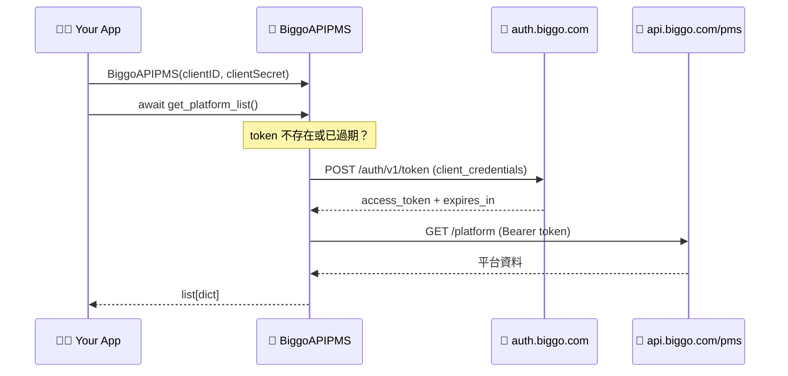
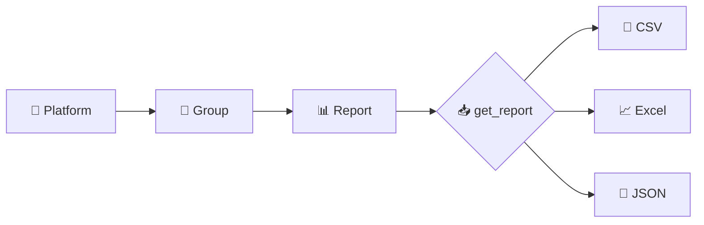

# 🐍 BigGo API PMS — Python Client

> 🛒 BigGo PMS (Price Monitoring System) 的官方 Python client，讓你用幾行程式碼就能存取平台、群組與歷史報表。

[](https://pypi.org/project/biggo-pms-api-python/)
[](https://www.python.org/)
[](./LICENSE)

---

## ✨ Features

- 🔑 **自動 token 管理** — 自動處理 OAuth2 `client_credentials` 換發與過期續期
- 🏬 **平台 / 群組 / 報表** — 完整存取 PMS 資源階層
- 📦 **多格式下載** — 支援 `csv` / `excel` / `json` 報表下載，可直接存檔
- ⚡ **async / await** — 以非同步介面提供

---

## 📑 Table of Contents

- [🚀 Getting Started](#-getting-started)
  - [📥 Installation](#-installation)
  - [🔧 Usage](#-usage)
  - [🏗️ Initializing](#️-initializing)
  - [📡 Accessing BigGo API PMS](#-accessing-biggo-api-pms)
- [🧭 How It Works](#-how-it-works)
- [📚 API Reference](#-api-reference)
- [📄 License](#-license)

---

## 🚀 Getting Started

### 📥 Installation

使用 pip：

```shell
pip install -U biggo_pms_api_python
```

### 🔧 Usage

```python
from biggo_pms_api_python import BiggoAPIPMS
```

### 🏗️ Initializing

先從 BigGo API 取得 client id 與 secret，再用以下程式碼建立 API 物件：

```python
api = BiggoAPIPMS(clientID=client_id, clientSecret=client_secret)
```

> 💡 還沒有 client id / secret？請參考 👉 [Funmula-Corp/guide](https://github.com/Funmula-Corp/guide)

### 📡 Accessing BigGo API PMS

```python
# 🏬 取得使用者可存取的平台列表
platform_list = await api.get_platform_list()

# 👥 取得平台內的群組列表
group_list = await api.get_group_list('<Platform ID>')

# 📊 取得平台內的歷史報表列表
report_list = await api.get_report_list('<Platform ID>')

# 📥 取得報表內容，或直接存成檔案
report_json = await api.get_report('<Platform ID>', '<Report ID>', 'json')
```

> 📖 更多細節請參考 [完整文件](./biggo_pms_api_python/README.md)。

---

## 🧭 How It Works

🔐 **認證流程**：SDK 會在第一次請求時自動換發 token，並在過期前自動續期。



🗂️ **資源階層**：平台底下有群組，群組會產生報表，報表可下載成多種格式。



---

## 📚 API Reference

| 方法 | 說明 | 回傳 |
| --- | --- | --- |
| `await get_platform_list()` | 🏬 取得可存取的平台列表 | `list[dict]` |
| `await get_group_list(platformID)` | 👥 取得平台內的群組列表 | `list[dict]` |
| `await get_report_list(platformID, options=None)` | 📊 取得歷史報表列表 | `list[dict]` |
| `await get_report(platformID, reportID, fileType, options=None)` | 📥 下載報表（`csv`/`excel`/`json`） | `bytes` 或檔案路徑 |
| `set_token(token, expiresAt, tokenType='Bearer')` | 🔑 手動設定 token | `self` |
| `is_token_expired()` | ⏳ 檢查 token 是否過期 | `bool` |

`get_report_list` 的 `options` 可帶 `size`、`sort`、`startIndex`、`groupID`、`startDate`、`endDate`。
`get_report` 的 `options` 可帶 `saveAsFile`、`saveDir`、`fileName`。

---

## 📄 License

[MIT](./LICENSE)
